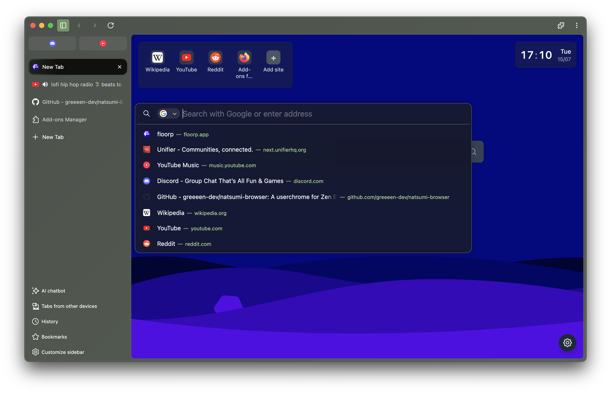
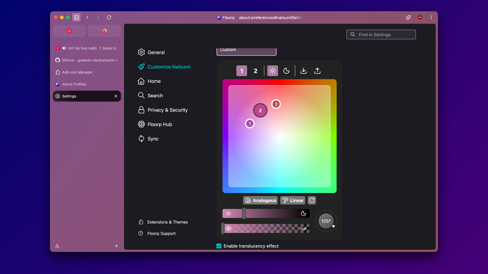
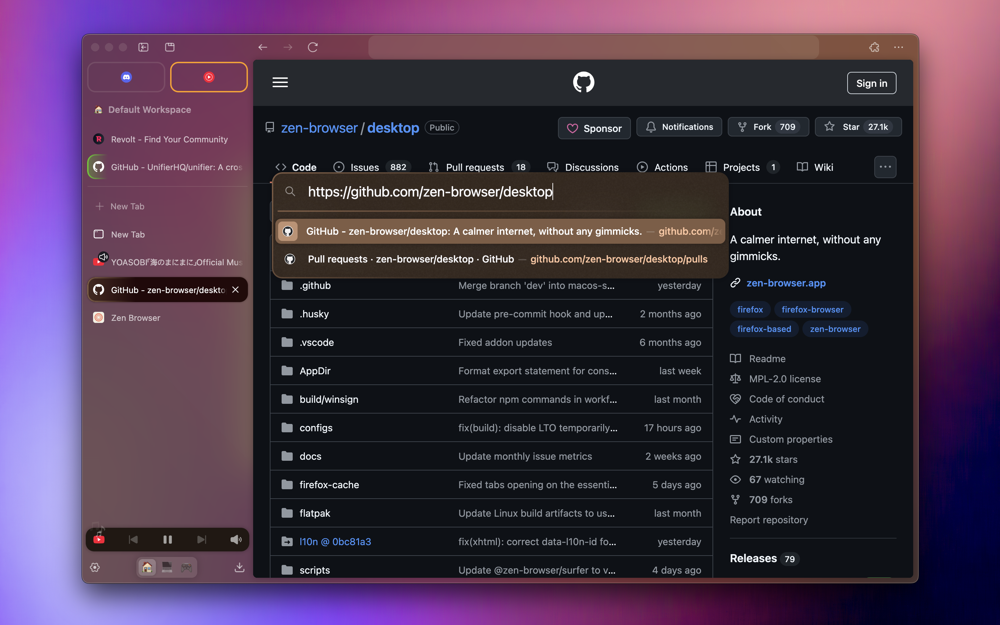
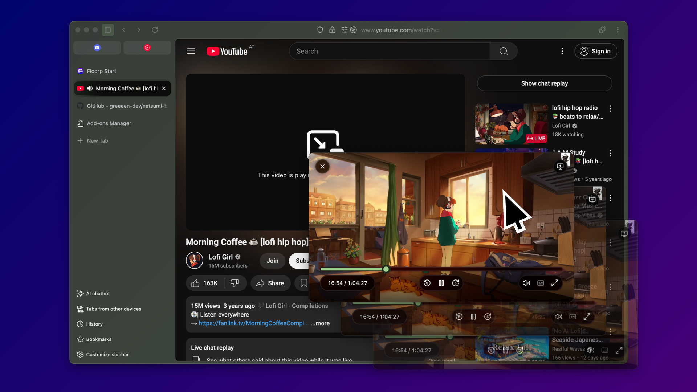
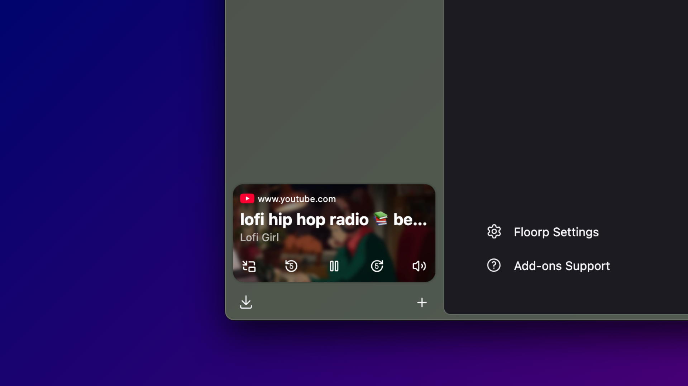
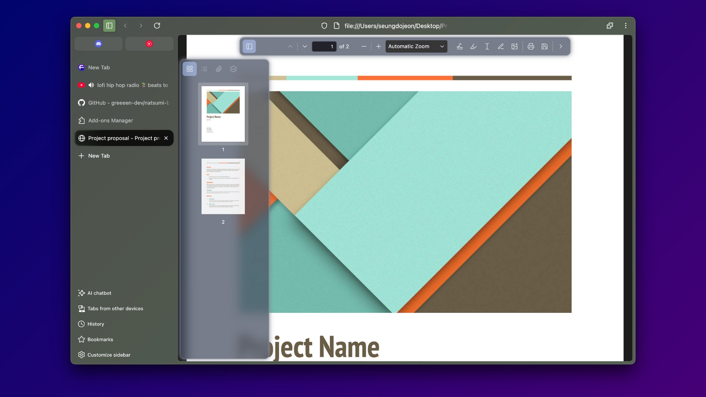
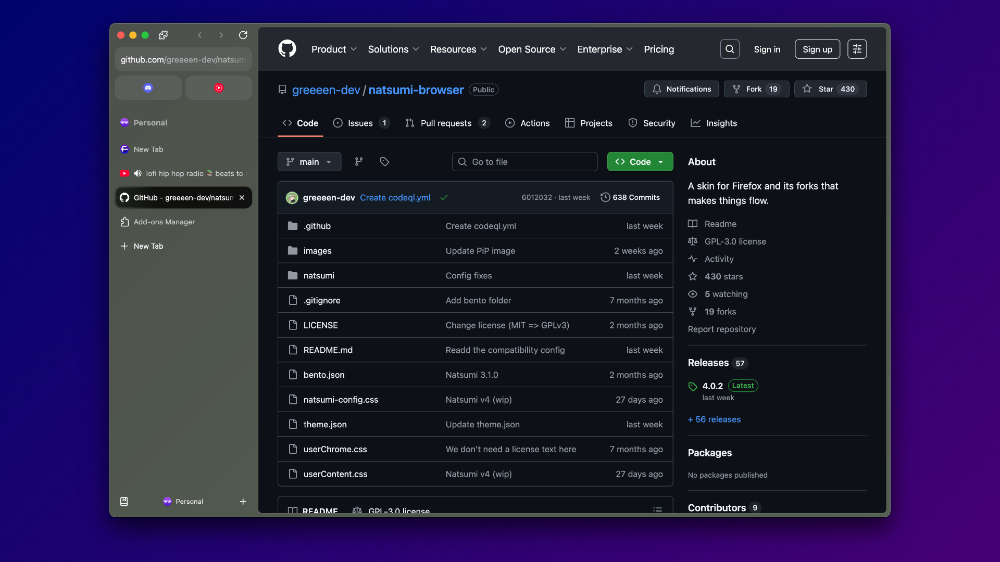
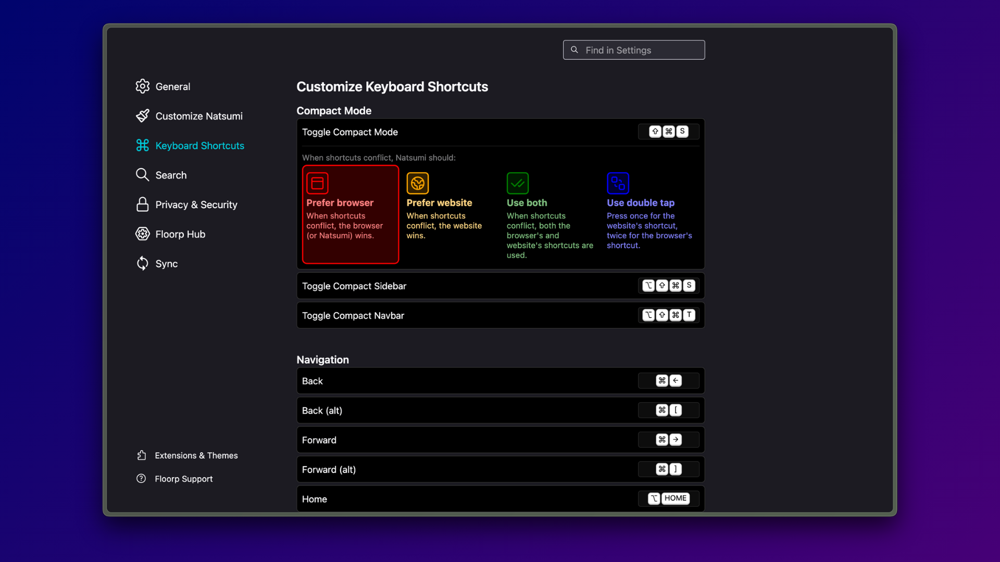
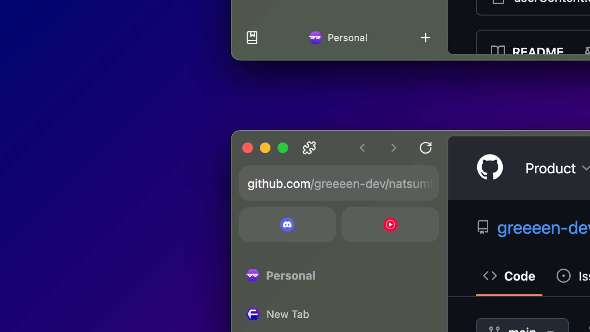

<h1 align="center">
  
  <br>
  Natsumi Browser
</h1>

<p align="center">
  Welcome to your <strong>personal</strong> internet.
</p>
<h5 align="center">
  <a href="https://natsumi.greeeen.dev">Website (under construction)</a> • <a href="https://natsumi.greeeen.dev/discord">Discord</a>
</h5>



> [!IMPORTANT]
> If you're from [this Twitter post](https://x.com/moonyandfriends/status/2001035508558811142) and want
> to learn more about this project, go [here](#twitter-questions-and-answers)

## Meet Natsumi! 🦋
Meet Natsumi Browser (or Natsumi, for short) - a browser mod that truly puts you in control.

Natsumi Browser (or Natsumi, for short) is a skin made for Firefox and its forks that adds lots of
polish to the design and adds new features to further enhance the browsing experience, while retaining
customization options to allow you to fully make things yours.

Natsumi is NOT a standalone browser. It only supports Firefox-based browsers that are not known to
be hostile towards user personalization.

> [!NOTE]
> Please remember that Natsumi in the end is **my personal browser skin**. If you don't like a design
> choice I've made, chances are I'll keep it if I still like it. So please be respectful and refrain
> from attacking people when you make suggestions. Thanks!

## Features
Natsumi has lots of features to enhance your browser - so many that I can't list them all here!

### ✨ Reimagined design. Fully customizable.
#### The classic Firefox design but with a modern yet customizable spin.


Natsumi keeps your browser's design familiar while adding a modern touch to it. Not only that, it's
also **extremely customizable**, so you can make it truly yours. No "best practices" or authoritarian
design ideologies to stop you, just a browser that works with you and not against you.

Almost all customization options are accessible through a dedicated preferences pane, so you don't
have to mess around with advanced preferences.

### ⌨️ URL bar, made intuitive.
#### Highlights the current URL and adapts to the scene.


Natsumi applies a fresh new coat of paint to your browser's URL bar, making the current URL stand out
more and changing colors dynamically based on context.

### 🖥️ Reimagined Picture-in-picture.
#### Modern and streamlined.



Natsumi's Picture-in-picture adds a more modern look to Firefox's PiP to make it more consistent with
the rest of the browser. You can even scroll to reposition the PiP window, too!

### 🎛️ Meet your Miniplayer.
#### Keep your media in control.


Natsumi lets you control your media through the Miniplayer located on the sidebar. And with support
for multiple websites at a time, you don't have to make your tabs fight for a spot.

### 📄 PDF viewer, modernized.
#### View your documents in the 21st century.



Give Firefox's PDF viewer a fresh coat of paint! Natsumi includes tweaks for the default PDF viewer,
giving it the modern look it really deserves. And with compact view, you can focus on the file at
hand when you don't need the extra tools.

### 🧘 Featuring Single Toolbar.
#### Go minimal or go utility-first, it's your choice.


Not a fan of multiple toolbars? Craving more horizontal space? Natsumi adds it to your browser of
choice.

And of course, you can always use the Multiple Toolbars layout. Natsumi doesn't force things on you.

### ⌨️ Customize your shortcuts.
#### Featuring keyboard shortcut conflict controls.


Take full control of your browser's keyboard shortcuts! Natsumi lets you customize your shortcuts
to your likings and even lets you choose how it should handle shortcut conflicts between the browser
and websites. No more being forced to show mercy to websites when shortcuts conflict.

### 🍰 Additional browser-specific goodies.
#### Get extra features custom-made for specific browsers.


Does your browser have Workspaces? Or another toolbar that can be used in the sidebar? Natsumi adds
extra features to your browser for a more complete experience.

## Full-fledged vs. CSS-only
Some Natsumi features require JavaScript to work. You can still use Natsumi without JS support at the
cost of losing some features.

| Feature                            | Full (Natsumi + Natsumi Append) | CSS-only (Natsumi) |
|------------------------------------|---------------------------------|--------------------|
| Natsumi URLbar/Findbar             | :white_check_mark:              | :white_check_mark: |
| Natsumi PDF Viewer                 | :white_check_mark:              | :white_check_mark: |
| Natsumi PiP                        | :white_check_mark:              | :warning: Limited  |
| Natsumi Miniplayer                 | :white_check_mark:              | :x:                |
| Theming engine                     | :white_check_mark:              | :white_check_mark: |
| Customize Natsumi preferences page | :white_check_mark:              | :x:                |
| Custom themes                      | :white_check_mark:              | :x:                |
| Single Toolbar                     | :white_check_mark:              | :x:                |
| Compact Mode                       | :white_check_mark:              | :x:                |
| Status bar as sidebar toolbar      | :white_check_mark:              | :x:                |
| Natsumi Shortcuts                  | :white_check_mark:              | :x:                |


## Installation
You will need to install Natsumi by copying its files to your profile's chrome folder.

### Automatic install
#### Installing via installer (macOS/Linux only)
Every release of Natsumi from v5 comes with an installer binary. You can run it to install Natsumi
Browser, Natsumi Browser Pages and Natsumi Append to your browser and profile of choice.

> [!NOTE]
> For macOS users, you will need to override the unsigned binary warning (also known as the "Apple could
> not verify "App" is free of malware" warning) by going to System Preferences => Security & Privacy
> after trying to run the installer.

> [!WARNING]
> For Flatpak installations, you will need to manually install Natsumi to make it functional. See **Manual
> Install** for more details.

#### Installing via installer (Windows only)
Download and run `windows-installer.bat` as Admin and follow the on-screen prompts. 

You can get this file from the `Installers` folder in this repo.

> [!NOTE]
> The Windows installer needs to run as Admin so it can copy the needed files to the correct system locations.
> To update Natsumi on Windows, run the `windows-installer.bat` again with your browser closed.

#### Installing via Sine
> [!WARNING]
> Installing via Sine is supported but not recommended. The following features will not work:
> - Any features included in Natsumi Append
> - Icon packs aside from Firefox default

You can install the CSS-only version of Natsumi through [Sine](https://github.com/CosmoCreeper/Sine).

### Manual install
Remember to take backups of your userChrome.css and userContent.css files before proceeding!

#### Installing Natsumi Browser and Natsumi Browser Pages
1. Copy natsumi-config.css, userChrome.css, userContent.css and natsumi folder to your chrome folder.
2. That's it - Natsumi (CSS-only) is installed!

#### Installing Natsumi Append (optional)
Installing Natsumi Append allows you to use the full feature set of Natsumi Browser, but it's not
required for the core parts of Natsumi to work.

Natsumi Browser needs to be installed before you can install Natsumi Append.

1. Install [fx-autoconfig](https://github.com/MrOtherGuy/fx-autoconfig) to your browser. You need to
   install the contents of both program and profile/chrome, follow the instructions in the fx-autoconfig
   repository.

   **Note**: The guide doesn't mention the module_loader.mjs file, but you'll need this for fx-autoconfig
   to work. Otherwise, Natsumi's modules will show in your scripts but won't actually be loaded.

   **Flatpak users**: You may need to follow steps 1 and 2 on
   [here](https://github.com/MrOtherGuy/fx-autoconfig/issues/48#issuecomment-3315929253), but replace
   `app.zen_browser.zen` with the package identifier of your browser (e.g. `one.ablaze.floorp`).
2. Copy the following to chrome/utils/chrome.manifest:
   ```
   content userchromejs ./
   content userscripts ../natsumi/scripts/
   skin userstyles classic/1.0 ../CSS/
   content userchrome ../resources/
   content natsumi ../natsumi/
   content natsumi-icons ../natsumi/icons/
   ```
3. Create and enable `userChromeJS.persistent_domcontent_callback` before restarting (don't worry, you
   can do this later. This config is needed for the preferences page to work.)
4. Go to about:support and clear your startup cache and restart your browser (this may not be required but
   it is still recommended).
5. That's it - Natsumi Append is installed!

#### Advanced setup: If you are a techie who wants to keep your files up-to-date with new changes over time
After following either of the above steps, if you are interested in ensuring that you upgrade to the
latest version of Natsumi as new changes are released, you can simply clone the repository into the `chrome`
folder. This can be followed up with `git pull` from time-to-time.

## Browser configs (in about:config)
These are the configs you can use to tweak Natsumi Browser. If you want to tweak the animation duration
and delay, change the variables in the config.css file.

If you have Natsumi Append installed, most of these can be tweaked through the preferences page.

<details>
<summary><strong>View configs</strong></summary>

### 🎨 Theming/General
- `natsumi.theme.type` (string): Sets the browser theme type.
  - Enter a theme ID from the themes list in the [Features](#features) section.
- `natsumi.theme.accent-color` (string): Sets the browser theme color from a given accent color.
  - $${\color{#a0d490}■}$$ **Light green** (default) - #a0d490
  - $${\color{#aac7ff}■}$$ **Sky blue** (`sky-blue`) - #aac7ff
  - $${\color{#74d7cb}■}$$ **Turquoise** (`turquoise`) - #74d7cb
  - $${\color{#dec663}■}$$ **Yellow** (`yellow`) - #dec663
  - $${\color{#ffb787}■}$$ **Peach Orange** (`peach-orange`) - #ffb787
  - $${\color{#ff9eb3}■}$$ **Warmer Pink** (`warmer-pink`) - #ff9eb3
  - $${\color{#dec1b1}■}$$ **Beige** (`beige`) - #dec1b1
  - $${\color{#ffb1c0}■}$$ **Light Red** (`light-red`) - #ffb1c0
  - $${\color{#ddbcf3}■}$$ **Muted Pink** (`muted-pink`) - #ddbcf3
  - $${\color{#f6b0ea}■}$$ **Pink** (`pink`) - #f6b0ea
  - $${\color{#d4bbff}■}$$ **Lavender Purple** (`lavender-purple`) - #d4bbff
  - $${\color{#ffffff}■}$$ **System Accent** (`system`) - uses your system's accent color
- `natsumi.theme.force-natsumi-color` (boolean): Forces Natsumi's accent color set in natsumi-config.css
  to be used instead of the current Firefox theme's colors.
- `natsumi.theme.use-tab-theme-color` (boolean): Uses the tab border color as the accent color for Blade.
  This may break Blade on some themes.
- `natsumi.theme.max-custom-colors` (integer): The maximum number of custom colors you can choose. Minimum
  and default is 6.
- `natsumi.theme.disable-translucency` (boolean): Disables the translucency effect.
- `natsumi.theme.use-legacy-translucency` (boolean): Uses legacy translucency on macOS or Windows.
- `natsumi.theme.gray-out-when-inactive` (boolean): Grays out the browser when inactive.
- `natsumi.theme.single-toolbar` (boolean): Enables Single Toolbar layout.
- `natsumi.theme.single-toolbar-show-menu-button` (boolean): Shows the menu button when in Single Toolbar.
- `natsumi.theme.single-toolbar-hide-extensions-button` (boolean): Hides the extensions button when in
  Single Toolbar.
- `natsumi.theme.show-bookmarks-on-hover` (boolean): Shows the bookmarks bar on hover when in Single
  Toolbar.
- `natsumi.theme.customizable-single-toolbar` (boolean): Moves toolbar buttons to the overflow menu when
  in Single Toolbar.
- `natsumi.theme.force-customizable-single-toolbar` (boolean): Force shows the overflow button if it
  doesn't show for some reason.
- `natsumi.theme.compact-marginless` (boolean): Removes the frame around the website content when in 
  compact mode.
- `natsumi.theme.compact-on-new-window` (boolean): Enables Compact Mode by default for new windows.
- `natsumi.theme.compact-style` (string): Sets the Compact Mode style.
  - `default` (Hide both): Hides both the toolbar and sidebar.
  - `toolbar` (Hide toolbar): Hides only the toolbar.
  - `sidebar` (Hide sidebar): Hides only the sidebar.
- `natsumi.theme.force-window-controls-to-left` (boolean): Forces window controls to the sidebar rather
  than the bookmarks bar.
- `natsumi.theme.classic-preferences` (boolean): Disables Natsumi's preference page theming.
- `natsumi.theme.floorp-hide-preferences-warnings` (boolean): Hides Floorp Hub warnings on the preferences
  page. **Floorp exclusive.**
- `natsumi.theme.icons` (string): Sets the icon pack used in Natsumi.
  - `default` (Firefox default): Default Firefox icons.
  - `lucide`: Lucide icons.
  - `fluent`: Fluent UI Icons.
- `natsumi.theme.icons-alt-back-forward` (boolean): Uses alternative back/forward icons.
- `natsumi.theme.ignore-css-issues`: Ignores CSS issues and prevents the CSS warning from showing up.

### 🗂️ Tabs & Sidebar
- `natsumi.tabs.use-custom-type` (boolean): Enables custom tab types. Blade is used when this is disabled.
- `natsumi.tabs.type` (string): Sets a custom tab type. `natsumi.tabs.use-custom-type`
  - `default` (Blade): A modern and sleek, yet dynamic tab design.
  - `origin`: A box-like design inspired by Natsumi v1.
  - `curve`: A curve-like design inspired by Natsumi v2.
  - `fusion`: A Lepton-like design that 'combines' tab and web content.
  - `material`: A material-like design inspired by Zen Browser's alpha UI.
  - `hexagonal`: A tab design inspired by Floorp's hexagonal branding.
  - `classic`: Just the standard Firefox look.
- `natsumi.tabs.blade-legacy-color` (boolean): Uses the legacy Blade tab highlight color like in v5 and
  older.
- `natsumi.tabs.fusion-highlight` (boolean): Adds a Photon (Firefox Quantum)-like highlight to the active
  tab for Fusion tab design.
- `natsumi.tabs.material-alt-design` (boolean): Uses an alternative design for Material tab design, similar
  to the toolbar buttons design in Natsumi.
- `natsumi.tabs.new-tab-on-top` (boolean): Moves the new tab button to the top of the tabs list.
- `natsumi.tabs.replace-new-tab` (boolean): Removes the New Tab entirely and opens the URL bar instead.
- `natsumi.tabs.workspace-specific-pins` (boolean): Makes pinned tabs specific to each workspace. **Floorp 
  exclusive.**
- `natsumi.sidebar.hide-clear-tabs` (boolean): Disables the clear unpinned tabs button.
- `natsumi.sidebar.clear-keep-selected` (boolean): Keeps selected tabs when clearing unpinned tabs.
- `natsumi.sidebar.clear-merge-with-workspaces` (boolean): Merges the clear unpinned tabs button with the
  Workspace indicator. **Floorp exclusive.**
- `natsumi.sidebar.clear-open-newtab` (boolean): Opens a new tab after clearing unpinned tabs.
- `natsumi.sidebar.disable-clickable-workspace-icons` (boolean): Disables clickable workspace icons when
  the workspaces toolbar button is set to display as an icons strip. **Floorp exclusive.**
- `natsumi.sidebar.floorp-floating-panel`: Floats the Panel Sidebar similar to Compact Mode. **Floorp
  exclusive.**
- `natsumi.sidebar.hide-sidebar-controls` (boolean): Hides sidebar controls.
- `natsumi.sidebar.use-statusbar-in-sidebar` (boolean): Uses Floorp or Waterfox's Status Bar as a toolbar
  for the sidebar when the Status Bar is "hidden". **Floorp and Waterfox exclusive.**
- `natsumi.sidebar.hide-workspace-indicator` (boolean): Hides the Floorp Workspace indicator added by
  Natsumi. **Floorp exclusive.**
- `natsumi.sidebar.legacy-workspace-indicator` (boolean): Uses the legacy Workspace indicator. Use this if
  the indicator is misbehaving. **Floorp exclusive.**
- `natsumi.sidebar.workspaces-as-icons` (boolean): Displays the Floorp Workspaces toolbar button as an icons
  strip. **Floorp exclusive.**

### ⌨️ URL bar
- `natsumi.urlbar.disabled` (boolean): Disables URL bar tweaks.
- `natsumi.urlbar.do-not-float` (boolean): Disables the floating URL bar.
- `natsumi.urlbar.always-expanded` (boolean): Disables the compact URL bar when inactive.
- `natsumi.urlbar.single-toolbar-display-actions` (boolean): Displays URL bar actions when in Single
  Toolbar.

### 🔎 Findbar
- `natsumi.findbar.disabled` (boolean): Disables Natsumi Findbar and reverts the findbar style back.
- `natsumi.findbar.disable-not-found-bg` (boolean): Disables red background that appears when there are no
  results.
- `natsumi.findbar.wider-findbar` (boolean): Increases maximum Findbar width back to 720px.

### 🎛️ Miniplayer
- `natsumi.miniplayer.disable-artwork` (boolean): Disables the artwork from showing in the Miniplayer.
- `natsumi.miniplayer.scroll-view` (boolean): Sets the Miniplayer list to be scrollable.

### 👀 Glimpse
- `natsumi.glimpse.enabled` (boolean): Enables Natsumi Glimpse.
- `natsumi.glimpse.multi` (boolean): Enables Multi Glimpse. Required for Glimpse Chaining.
- `natsumi.glimpse.key` (string): Sets the activation method for Glimpse.
  - `alt`: Alt key
  - `ctrl`: Ctrl key
  - `meta`: Meta (Command/Super) key
  - `shift`: Shift key
  - `hold`: Hold (click and hold)
- `natsumi.glimpse.controls-on-right` (boolean): Moves Glimpse controls to the right.
- `natsumi.glimpse.alt-border` (boolean): Uses an alternative border color to highlight Glimpse tabs more.
- `natsumi.glimpse.show-indicator` (boolean): Shows a Glimpse indicator right above the Glimpse tab.

### 🖥️ Picture-in-Picture
- `natsumi.pip.disabled` (boolean): Disables Natsumi PiP and reverts the PiP style back.
- `natsumi.pip.disable-scroll-to-move` (boolean): Disables the ability to scroll to move the PiP window.
- `natsumi.pip.legacy-style`: Merges PiP controls into one "island" like in Natsumi v3.
- `natsumi.pdfjs.material` (string): Sets the material used in the PiP elements. Haze is used when this is
  unset.
    - `haze`: Haze
    - `tinted-haze`: Tinted Haze
- `natsumi.pip.rounded` (boolean): Makes the PiP window round, like in macOS. Only supports Windows.

### 📄 PDF Viewer
- `natsumi.pdfjs.disabled` (boolean): Disables Natsumi PDF Viewer and reverts the PDF viewer back.
- `natsumi.pdfjs.compact` (boolean): Enables toolbar autohide for Natsumi PDF Viewer.
- `natsumi.pdfjs.compact-dynamic` (boolean): Disables toolbar autohide when the PDF Viewer's sidebar is
  expanded.
- `natsumi.pdfjs.material` (string): Sets the material used in the PDF viewer elements. Haze is used when
  this is unset.
  - `haze`: Haze
  - `tinted-haze`: Tinted Haze

### 🏠 Firefox Home
- `natsumi.home.disabled` (boolean): Disables Natsumi FF home and reverts the FF home page back.
- `natsumi.home.custom-background` (boolean): Uses the custom background set in config as the home 
  screen background.

### 🔧 Compatibility
- `natsumi.browser.type` (string): Sets the browser type to enable browser-exclusive features and patches.
  **If you use Natsumi Append, this preference will be automatically set.**
  - `firefox`: Mozilla Firefox
  - `floorp`: Floorp Browser
  - `waterfox`: Waterfox
  - `librewolf`: Librewolf
  - `tor`: Tor Browser
  - `mullvad`: Mullvad Browser
  - `firedragon`: FireDragon
- `natsumi.browser.disable-auto-detect` (boolean): Disables automatic browser detection. Use this if you
  need to manually set the browser type. **Requires restart to take effect.**
</details>

## Browser support
All browsers must be based on Firefox 137 or above.

| Browser     | Status                       | Versions | Notes                                                                                     |
|-------------|------------------------------|----------|-------------------------------------------------------------------------------------------|
| Floorp      | :star: Recommended           | 12.3.0+  | Natsumi works best on Floorp!                                                             |
| Firefox     | :white_check_mark: Supported | 137+     |                                                                                           |
| Waterfox    | :white_check_mark: Supported | 6.6.0+   |                                                                                           |
| Librewolf   | :white_check_mark: Supported | 137+     |                                                                                           |
| Mullvad/Tor | :white_check_mark: Supported | 15.0+    | **Tor does not recommend installing plugins onto Tor Browser.** Proceed at your own risk. |
| FireDragon  | :white_check_mark: Supported | 12+      | Default Sweet-Dark theme may cause contrast issues with Natsumi.                          |
| Glide       | :white_check_mark: Supported | 0.1.54a+ |                                                                                           |
| Midori      | :x: Unsupported              | -        | Incompatible (see FAQ)                                                                    |
| Zen         | :x: Unsupported              | -        | Incompatible since Natsumi v4 (see FAQ)                                                   |

## FAQs
### "Can I use other userchromes with Natsumi?"
Sure! Just paste it right below the Natsumi Browser loader (userChrome.css) and you can use your own
userchrome alongside Natsumi Browser.

### "Can I disable individual features?"
You can disable some features using the configuration options.

If that doesn't help, you can remove certain modules (CSS files) from the natsumi.css file. However,
you will need to keep certain files (preload, postload, natsumi-config) for Natsumi to work properly.

> [!CAUTION]
> By modifying any part of Natsumi, you are responsible for any issues that may arise. If things do
> break, I will most likely not offer support for it.
> 
> If you installed Natsumi as part of another skin, your installation may be considered modified.
> Please check with the skin's developer for assistance in this case.

### "Is Natsumi compatible with Zen Browser?"
As of Natsumi v4, Natsumi has dropped all support for Zen Browser. I have no plans to continue
support whatsoever due to the browser's main developer's stance on personalization, as well as
various other reasons.

Additionally, it'd be a hassle to make things compatible with Zen, mainly because it is just so
heavily modified from the original Firefox that I may end up building a whole new skin just for
compatibility unintentionally.

**Please do not try to port Natsumi to Zen.** I have my reasons why I left it, and I would
really appreciate it if you respected my decision.

### "Is Natsumi compatible with Midori?"
Natsumi does not support Midori and will not do so for the foreseeable future due to ethical
concerns. Please note that this is in no way related to Zen Browser being unsupported.

For more information, refer to this [blog
article](https://www.greeeen.dev/natsumi-midori-support.html).

### "When does Natsumi update?"
There is no fixed schedule for updates, it all happens randomly.

### "Is Natsumi compatible with non-Firefox-based browsers (Chrome, Arc, etc.)?"
No. Natsumi is made on top of Firefox, so it only supports Firefox and (most of) its forks.

If you try to apply Natsumi on Chrome/Chromium-based browsers like Arc, you can't apply
userchrome CSS files, making Natsumi completely incompatible with those browsers.

### "I don't like the design, please change it!"
Although Natsumi is designed to be as customizable as possible, there may be some opinionated
design choices that I may not change. In the end, Natsumi is still my personal browser skin.

If you would like me to add options for certain aspects of the browser, please open a feature request
and I will consider it.

### "Can I use your code for my browser?"
If your browser is open-source and licensed under the GPLv3 or later (or AGPLv3 or later), then yes.
Otherwise, please contact me so I can grant you permission.

### "Why is userChrome.css so empty?"
Natsumi Browser uses a system where the userChrome.css file acts as a loader that loads the skin,
instead of being the file that contains all rules. This way, it's easier for users to quickly enable
and disable custom CSS.

### "mrrp"
meow :3

## Troubleshooting
### "URLbar blur won't work!"
Make sure both `layout.css.backdrop-filter.enabled` and `layout.css.backdrop-filter.force-enabled` are
set to true. Also make sure that you're using WebRender and hardware rendering.

### "I don't see any of the Natsumi options in about:config!"
These are custom options which you need to create. Type in the exact name, then press the plus button on
the right to create the config.

You can also access most of the configs through the browser preferences page if Natsumi Append is
installed.

### "I don't see the Customize Natsumi option in the settings page!"
Please check that you've installed fx-autoconfig and `userChromeJS.persistent_domcontent_callback` is
true.

### "Natsumi looks very weird in Floorp/Waterfox!"
This may be because you do not have the Proton design (i.e. the default Firefox design) enabled. Natsumi
only supports Proton and does not support other designs such as Lepton or Fluerial.

You can fix this by going to Floorp Hub => Tab & Appearance in Floorp or Look & Feel in Waterfox.

### "I can't use custom skin X with Natsumi, please add support for it!"
This is not something I am able to help with. Natsumi is not tested with other themes in mind, so it is
possible that installing incompatible themes alongside Natsumi may break one or more of them.

### "Why is my browser showing as not compatible with Natsumi?"
> [!NOTE]
> This is for users seeing the compatibility warning after installing Natsumi. If you're wondering why
> the browser shows up as not compatible on the compatibility table, you may want to refer to the notes
> for each incompatible browser.

If you see this warning, it means Natsumi intentionally isn't supported on your browser due to serious
concerns or severe compatibility issues.

When a browser's developers have stances that go against Natsumi's core values (especially regarding
user customization) or a browser is heavily modified from Firefox to the point that it basically doesn't
use Firefox's selectors, this can sometimes lead to me having to push out patches often just to address
feature restrictions, compatibility issues and so on. This is not sustainable for me as Natsumi's
developer, so I intentionally do not support such browsers out of caution.

Please consider using another compatible browser or uninstall Natsumi.

### "Something's bugged!"
There may be userchromes that you're using alongside Natsumi Browser that breaks things. Please disable
these then try again.

If the issue still persists, open an issue or report the bug to the developer through Discord.

## Twitter Questions and Answers
because a specific twitter post about natsumi BLEW UP HOLY SH-

This is basically my answers to some of the comments I found interesting that was on the Twitter post in
question. I had a blast writing these.

### "I'm not using a browser called Floorp!"
Natsumi is browser-independent. Feel free to use it with anything other than Firefox and Floorp as long
as it's listed as compatible on the compatibility table!

(but why do you take problems with the fact that it's called Floorp to begin with...)

### "This is just a clone of Zen Browser!"
Although both Natsumi and Zen share similar UIs, it's not really a "clone" of Zen. Natsumi aims to be
polished AND as customizable as possible, while Zen gives maximum polish out of the box without much
customization freedom. It's two different design philosophies for two different target audiences, those
that want full control and those that just want "something that works".

Also, if Natsumi is a clone of Zen, then might as well call Zen a clone of Arc because the same case
applies here :wink:

### "This is just Discord if they tried to make a browser. I hate it."
Don't use it then.

Natsumi just applies a fresh coat of paint on top of your browser and adds a lot of customization
features as well as its own features. Pretty sure this is not really what Discord would do if they
wanted to make a browser.

### "Why not make something that's casual user centered?"
This is not really what Natsumi's built for. It's made to empower user customization and freedom, not
be a "works out of the box" thing like Zen or Arc is.

### "What's the benefits to using Natsumi?"
Natsumi lets you tweak a lot more things than a normal browser would. You can change your layours, pick
your tab design, and a lot more!

It also adds its own productivity features such as Glimpse, so feel free to try that out as well.

### "Is it open source?"
...yeah?

### "Is there something similar for a Chromium-based browser?"
Maybe for Vivaldi, but for other Chromium-based browsers I don't think so. Mods like Natsumi are only
possible on Firefox-based browsers and Vivaldi because of their open architecture to CSS and JS modding.

Please note that Natsumi is not compatible with any Chromium-based browsers including Vivaldi.

### "NOBODY is using this."
510 stars as of writing this says otherwise :3

## Acknowledgements
Thank you to:
- [asev](https://github.com/lunar-os) for ZenCss, which served as the base for Natsumi Browser's base
  CSS for v1
- [vicky5124](https://github.com/vicky5124) for the Tab Groups CSS used until v2.4.0
- [AlexCookieDev](https://github.com/AlexCookieDev) for inspiring some of the animations I used in Natsumi
  v2 and v3
- [InterstellarOne](https://github.com/InterstellarOne) for the Liquid Glass style Natsumi icons

## Disclaimer
THE SOFTWARE IS PROVIDED "AS IS", WITHOUT WARRANTY OF ANY KIND, EXPRESS OR IMPLIED, INCLUDING BUT NOT
LIMITED TO THE WARRANTIES OF MERCHANTABILITY, FITNESS FOR A PARTICULAR PURPOSE AND NONINFRINGEMENT. IN NO
EVENT SHALL THE AUTHORS OR COPYRIGHT HOLDERS BE LIABLE FOR ANY CLAIM, DAMAGES OR OTHER LIABILITY, WHETHER
IN AN ACTION OF CONTRACT, TORT OR OTHERWISE, ARISING FROM, OUT OF OR IN CONNECTION WITH THE SOFTWARE OR
THE USE OR OTHER DEALINGS IN THE SOFTWARE.

All screenshots displayed in this README are accurate as of December 2, 2025. If a feature was added,
changed or removed after this date, it may not be accurately reflected in the screenshots.

## Attribution
Natsumi Browser uses code or files from other open-source projects. The original sources and their
licenses are listed below.

> [!NOTE]
> For icon packs attribution, please check the README and LICENSE files in the icons folder for the
> respective icon pack.

- [MX-Linux/mx-sound-theme-borealis](https://github.com/MX-Linux/mx-sound-theme-borealis)
  
  License: GPLv3
  
  File used: `Borealis/stereo/desktop-login.ogg`, `Borealis/stereo/K3b_success.ogg`
  
  Changes made: none
  
- [MrOtherGuy/fx-autoconfig](https://github.com/MrOtherGuy/fx-autoconfig)

  License: MPL-2.0

  Files used: `program` (folder), `profile/chrome/CSS` (folder), `profile/chrome/utils` (folder), `profile/chrome/resources` (folder)

  Changes made: Modified `profile/chrome/utils/chrome.manifest` (changes shown using diff formatting):
  - ```diff
    ...
    - content userscripts ../JS/
    + content userscripts ../natsumi/scripts/
    ...
    content userchrome ../resources/
    + content natsumi ../natsumi/
    + content natsumi-icons ../natsumi/icons/
    ```
